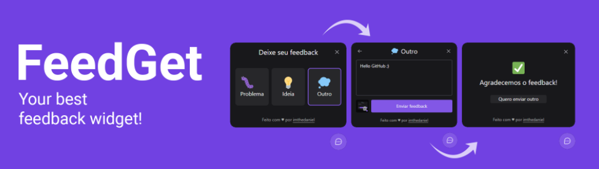

<h1 align="center">
	FeedGet
</h1>

<p align="center">
  <a href="#-tecnologias">Tecnologias</a>&nbsp;&nbsp;&nbsp;|&nbsp;&nbsp;&nbsp;
  <a href="#-projeto">Projeto</a>&nbsp;&nbsp;&nbsp;|&nbsp;&nbsp;&nbsp;
  <a href="#-features">Features</a>&nbsp;&nbsp;&nbsp;|&nbsp;&nbsp;&nbsp;
  <a href="#-layout">Layout</a>&nbsp;&nbsp;&nbsp;|&nbsp;&nbsp;&nbsp;
  <a href="#-como-contribuir">Como contribuir</a>&nbsp;&nbsp;&nbsp;|&nbsp;&nbsp;&nbsp;
  <a href="#memo-licença">Licença</a>
</p>

<p align="center">
  

  

  <a href="https://www.linkedin.com">
    
  </a>

  <a href="https://github.com/RafaelMartinsRibeiro/FeedbackWidget-NlwReturn/commits/master">
    
  </a>

  

   <a href="https://github.com/RafaelMartinsRibeiro/FeedbackWidget-NlwReturn/stargazers">
    
  </a>
</p>


<h1 align="center">
  
</h1>


## 🚀 Tecnologias

Esse projeto foi desenvolvido com as seguintes tecnologias:

- [TypeScript](https://www.typescriptlang.org)
- [React](https://reactjs.org)
- [TailwindCSS](https://tailwindcss.com)
- [Vite](https://vitejs.dev)


## 💻 Projeto

FeedGet é um aplicativo de feedbacks, desenvolvido 100% responsivo para ser integrado a qualquer aplicação web ou mobile. O usuário consegue além de escolher a categoria de seu feedback, também pode enviar uma mensagem personalizada junto a uma captura de tela automática. 


## 🌟 Features

-   [ ] Categorias de feedbacks, sendo possível adicionar/remover de forma fácil.
-   [ ] 100% responsivo em resoluções até 4k.
-   [ ] Captura de tela automática, sem a necessidade de salvar uma imagem.
-   [ ] Projeto 100% acessível sendo possível por exemplo, utilizá-lo somente pelo teclado, entre outras funções de acessibilidade.


## 🎨 Layout

Você pode visualizar o layout do projeto através [desse link](https://www.figma.com/file/Wvro4wRJXn4Onm9GHX5DFi/Feedback-Widget-(Community)?node-id=100%3A3925). É necessário ter conta no [Figma](https://figma.com) para acessá-lo.


## 🤔 Como contribuir

- Faça um fork desse repositório;
- Cria uma branch com a sua feature: `git checkout -b minha-feature`;
- Faça commit das suas alterações: `git commit -m 'feat: Minha nova feature'`;
- Faça push para a sua branch: `git push origin minha-feature`.


### 🧭 Rodando a aplicação

```bash
# Clone este repositório
$ git clone https://github.com/RafaelMartinsRibeiro/FeedbackWidget-NlwReturn
# Acesse a pasta do projeto no seu terminal/cmd
$ cd NlwReturn
# Instale as dependências
$ npm install
# Execute a aplicação em modo de desenvolvimento
$ npm run dev
# A aplicação será aberta na porta:3000 - acesse http://localhost:3000
```


## :memo: Licença

Esse projeto está sob a licença MIT. Veja o arquivo [LICENSE](LICENSE.md) para mais detalhes.

---
